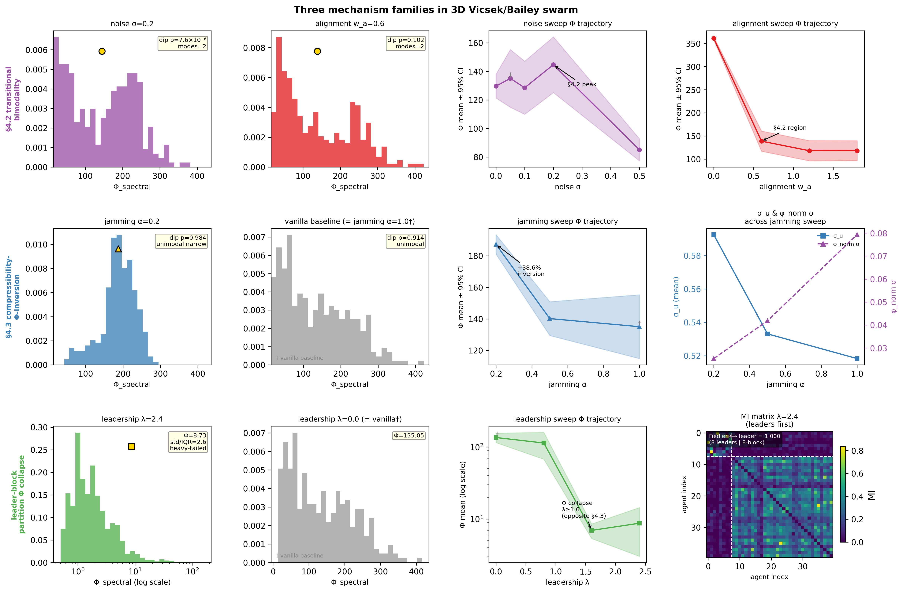
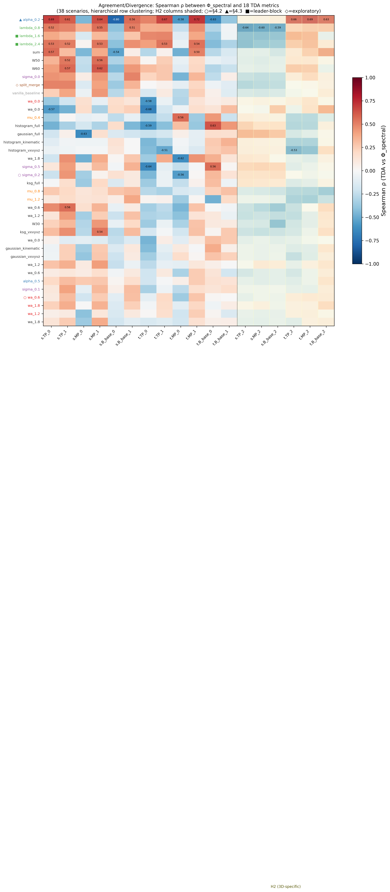
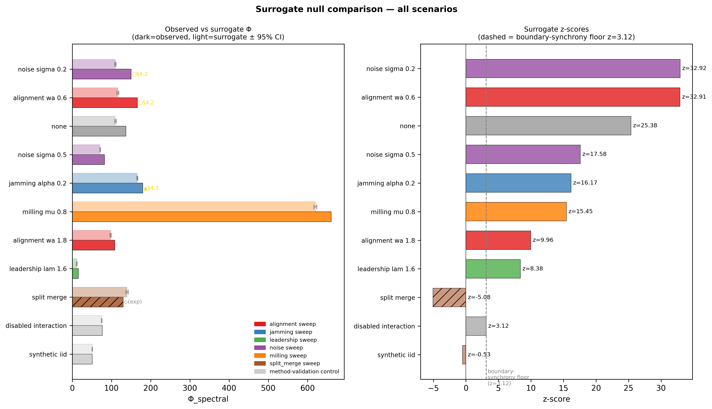
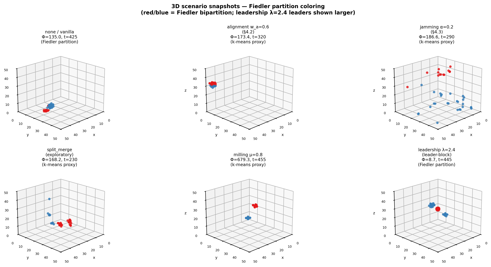

# Spectral Swarm 3D

**3D extension of the spectral–topological swarm-analysis pipeline of Bailey (2026) and Bailey & Schneider (2025), tested on a 3D Vicsek/Bailey boids simulator.**

| | |
|---|---|
| **Status** | Phase 5 complete (interpretive draft, 2026-05-07) |
| **Predecessor** | [`Spectral_Swarm`](https://github.com/StevenFAU/Spectral_Swarm) at tag `v0.1-2d-poc` (frozen 2D proof of concept) |
| **License** | MIT |
| **Python** | ≥ 3.12 (Mesa ≥ 3.4) |

---

## What this project does

Each run is a 3D Vicsek/Bailey swarm simulation (`N=40` agents in a `50³` reflective box, `T=500` steps), and each run is analyzed in two parallel ways on the same sliding windows:

- **Spectral branch.** Pairwise mutual information between agent kinematic embeddings (KSG-1 estimator) → MI graph → normalized Laplacian → Fiedler bipartition → `Φ_spectral` as the cross-cut MI sum. This is the spectral-integration measure of Bailey & Schneider (2025), which approximates IIT-style irreducibility in a tractable, observational, pairwise form.
- **Topological branch.** Vietoris–Rips persistent homology (Ripser, `maxdim=2`) on per-window spatial snapshots, summarized as `snap_TP_k`, `snap_MP_k` for `k ∈ {0,1,2}` plus bottleneck distances. H2 is the 3D-specific addition over the 2D pipeline.

Running these two descriptors on identical windows and asking *where they agree and where they diverge* is the project's methodological contribution. A given regime can produce high spectral integration while topology stays flat (or the reverse), and those divergences are themselves interpretable.

The full landscape framing — where `Φ_spectral` sits among IIT 4.0, PID/ΦID, transfer entropy, and pairwise-MI measures — lives in [`ResearchContext.md`](./ResearchContext.md). The decisions log (Cluster A–D) lives in [`SpectralSwarm3DPhases.md`](./SpectralSwarm3DPhases.md).

---

## Headline finding

The Bailey & Schneider §4.2/§4.3 framework operates **mechanism-specifically across three orthogonal perturbation axes**, and the framework's empirical reach across the 11 sweeps is sharper than the original D14 generalization claim anticipated.



*Figure 1 — Three mechanism families. Row 1 (purple/red): §4.2 transitional Φ peak — confirmed at noise σ=0.2 and alignment w_a=0.6. Row 2 (blue): §4.3 compressibility-Φ-inversion — confirmed at jamming α=0.2 with +38.6% mean-Φ inversion above coherent baseline. Row 3 (green): leader-block partition Φ collapse at leadership λ≥1.6 — a structurally distinct mechanism, not a §4.3 instance.*

| Family | Sweep / condition | Signature | Surrogate z |
|---|---|---|---|
| §4.2 transitional bimodality | noise σ=0.2 | dip-test p=7.6×10⁻⁶, two modes | +32.92 |
| §4.2 transitional bimodality | alignment w_a=0.6 | dip-test p=0.102, two modes | +32.91 |
| §4.3 compressibility-Φ-inversion | jamming α=0.2 | +38.6% Φ inversion; σ_u floor-locked; φ_norm σ reduced | +16.17 |
| Leader-block partition (new) | leadership λ=2.4 | Φ collapse below baseline; Fiedler ↔ leader-membership = 1.000; 8×8 high-MI block | +8.38 (at λ=1.6) |
| Exploratory | split_merge | Observed Φ below null (single seed) | −5.08 |

The leadership sweep was pre-registered (Phase 5 Tier 1.A) as a candidate third compressibility instance. The data falsified that prediction (Outcome 4 verdict, commit `9ad6a5a`): Φ at high λ collapses *below* the coherent baseline rather than inverting *above* it, and the MI matrix shows a leader/follower block-structure rather than the uniform floor-locked dynamics characteristic of jamming. That refinement — compressibility is jamming-specific in this dataset, not a general cross-axis mechanism — is itself a Phase 5 result. The leader-block partition is reported as a separate empirical contribution.

The full empirical record is [`outputs/report/Phase5_Internal_Report.md`](./outputs/report/Phase5_Internal_Report.md).

---

## Other primary figures

### Spectral vs topological agreement across 38 scenarios



*Figure 4 — Spearman ρ between `Φ_spectral` and 18 TDA persistence metrics across all 38 scenarios. Rows are clustered hierarchically; H2 columns (3D-specific) are shaded on the right. Markers: ○ = §4.2 instance, ▲ = §4.3 instance, ■ = leader-block, ◇ = exploratory split_merge. The §4.2 jamming row separates from the §4.2 bimodality cluster, consistent with the mechanism distinction; H2 columns largely fail to discriminate scenarios at this N — a scale issue rather than a method issue (§7.1 of the report).*

### Surrogate null validation



*Figure 6 — Circular-shift surrogate nulls. The synthetic AR(1) i.i.d. control passes (z=−0.53, within surrogate 95% CI), method-validating the protocol. The disabled-interaction control sits at z=3.12 — preserved as the reflective-box **boundary-synchrony floor**, not a method bias. All eight science-scenario z-scores clear that floor; the strongest above-null results are the two §4.2 instances at z≈32.9. The split_merge below-null result at z=−5.08 is exploratory (single seed). Noise σ=0.5 was reclassified mid-run from method-validation entry to science scenario after the data showed it retains real cross-agent structure.*

### 3D scenario primer



*Figure 8 — Representative steady-state snapshots of six scenarios, colored by Fiedler bipartition of the per-window MI matrix (true MI for `none/vanilla` and `leadership λ=2.4`; spatial k-means proxy for the others, appropriate where the Fiedler partition reflects geometric proximity). The leader-block visual is most striking at `leadership λ=2.4`: leaders (larger markers) form a tight cluster that the Fiedler cut isolates from the follower bulk with perfect agreement.*

---

## Repository organization

```
Spectral_Swarm_3D/
├── pyproject.toml                  # spectral_swarm_3d package, deps (D5)
├── requirements-lock.txt           # pip freeze for reproducibility
├── conftest.py
├── README.md                       # this file
├── CLAUDE.md                       # conventions for Claude Code sessions
├── LICENSE                         # MIT
├── SpectralSwarm3DPhases.md        # plan + decision log (Clusters A–D, D1–D14)
├── Phase0.md                       # scaffolding record
├── Phase5.md                       # Phase 5 working plan (supersedes plan §Phase 5)
├── ResearchContext.md              # research positioning, methodology limits L1–L8
│
├── src/spectral_swarm_3d/
│   ├── model.py        agent.py    scenarios.py    telemetry.py
│   └── analysis/
│       ├── features.py mi.py       spectral.py     classical.py
│       ├── tda.py      aggregation.py              comparison.py
│       └── surrogates.py           plotting.py
│
├── tests/                          # pytest suites for every module above
├── configs/default.yaml            # all 3D parameters
│
├── scripts/
│   ├── run_single.py               run_sweep.py    analyze_sweep.py
│   ├── run_comparison.py           run_surrogates.py
│   └── render_scenario_videos.py
│
├── outputs/                        # parquet, summaries, figures
│   ├── <sweep>/<condition>/seed*/*.parquet
│   ├── <sweep>/cross_seed_summary.csv
│   ├── jamming_sweep/A2_PHI_INVERSION_DIAGNOSTIC.md  # canonical §4.3 mechanism reference
│   ├── tier1_compressibility/      # Tier 1.A verdict, MI diagnostic, distribution atlas
│   ├── comparison/cross_sweep/     # Tier 2 aggregated tables
│   ├── surrogates/                 # Tier 2.B nulls + README_summary.md
│   ├── report/Phase5_Internal_Report.md  # canonical Phase 5 record
│   └── figures/composition/primary/      # fig1, fig4, fig6, fig8 (and supplementary)
│
└── docs/
    ├── Swarm_Methodology2.pdf              # Bailey 2026 methodology paper
    ├── when_wholes_resist_decomposition.pdf # Bailey & Schneider 2025
    └── (additional supporting PDFs)
```

---

## Quick start

```bash
git clone https://github.com/StevenFAU/Spectral_Swarm_3D.git
cd Spectral_Swarm_3D
pip install -e .
pip install -e .[dev]      # ruff, pytest

pytest tests/ -v

# Single run
python scripts/run_single.py --scenario none --seed 0

# A sweep family
python scripts/run_sweep.py --sweep alignment_sweep --seeds 0..9

# Phase 4 aggregation (per-seed steady-state + cross-seed CIs per D2)
python scripts/analyze_sweep.py --sweep alignment_sweep

# Phase 5: comparison pipeline + surrogates
python scripts/run_comparison.py
python scripts/run_surrogates.py --scenarios all --seed 0
```

All randomness is via explicit seeds; under D6 deterministic seeding, runs reproduce bit-identical trajectories for the same seed (verified for the eight vanilla-baseline byte-identical conditions in Phase 5 Tier 1.C).

---

## Phase status

| Phase | Scope | Status |
|---|---|---|
| 0 | Scaffolding, package, configs, stubs | ✓ |
| 1 | 3D boids simulator + telemetry (Mesa 3 `ContinuousSpace`, mean alignment, vectorized step, reflective BCs) | ✓ |
| 2 | Φ_spectral pipeline: KSG MI, normalized Laplacian, Fiedler | ✓ |
| 3 | TDA pipeline: snapshot + trajectory persistence (H0/H1/H2) | ✓ |
| 3.5 | TDA-embedding probe → snapshot TDA promoted, trajectory TDA demoted (D9, D10) | ✓ |
| 4 | 11 sweep families × 10 seeds (280 runs); A2 diagnostic; D11–D14 closed | ✓ |
| 5 | Comparison aggregation, surrogate nulls, figures, internal report | ✓ |
| 6 | *Not started.* Hooks listed in `outputs/report/Phase5_Internal_Report.md` §10 | — |

---

## Key methodology decisions

The full record is in `SpectralSwarm3DPhases.md` Cluster D. Five matter most for reading the results:

- **D6 — Reproducibility.** Every run records git hash, Python version, package versions, and timestamp in its `metadata.json`. `requirements-lock.txt` pins the transitive dependency closure.
- **D10 — Trajectory-cloud TDA is exploratory only.** Phase 3.5 showed `traj_TP_k` was unreliable at `N=40`; snapshot TDA (`snap_TP_0`, `snap_TP_1`) is the primary candidate observable.
- **D11 — Histogram MI is sign-only.** With `W=40`, `d=4`, `n_bins=8`, the joint symbol space (8⁴=4096) far exceeds sample count and the histogram estimator saturates. KSG and Gaussian agree at perfect Spearman ρ=1.00 at the seed level; histogram η² columns are reported with a sign-only flag.
- **D12 — `angular_momentum_norm` decreasing with milling μ.** Expected 3D geometry (rotation-axis dilution), not an anomaly.
- **D14 — Compressibility mechanism.** Φ at jamming α=0.2 inverts above its coherent baseline because heavy jamming floor-locks σ_u into low-entropy steady-flight wobble. The original D14 generalization (compressibility as a mechanism across multiple sweeps) was tested and **narrowed** to jamming-specific by Phase 5 Tier 1.A — see Outcome 4 verdict at `outputs/tier1_compressibility/leadership_prediction_verdict.md`.

---

## Methodology limits worth flagging up front

These are articulated more fully in `ResearchContext.md` (limits L1–L8) and §9.6 of the Phase 5 internal report:

- **L1 — Pairwise MI is redundancy-weighted.** The §4.3 inversion is consistent in principle with both compressibility (Bailey & Schneider §4.3) and redundancy saturation (Luppi et al. 2024). The Phase 5 σ_u floor-lock evidence favors the compressibility reading specifically, but the structural limit remains.
- **L5 — Synchronic and diachronic components are entangled** in the sliding-window `Φ_spectral` (Bailey & Schneider 2025 §7). Separating them is named future work.
- **L7 — Finite-size at N=40.** H2 persistence underperforms at this scale (see Figure 4 right block). Whether the qualitative findings hold at N≥1000 is empirical; not yet tested.
- **L8 — In-silico only.** Real-telemetry validation (starlings, fish, drones) is named future work.

---

## Documentation map

If you are picking this up cold, in this order:

1. **This README** — orientation.
2. [`outputs/report/Phase5_Internal_Report.md`](./outputs/report/Phase5_Internal_Report.md) — the empirical record (§1 executive summary first; §4–§7 results; §9 discussion).
3. [`SpectralSwarm3DPhases.md`](./SpectralSwarm3DPhases.md) — the plan + decision log (start at Cluster D).
4. [`ResearchContext.md`](./ResearchContext.md) — landscape and limits.
5. [`outputs/jamming_sweep/A2_PHI_INVERSION_DIAGNOSTIC.md`](./outputs/jamming_sweep/A2_PHI_INVERSION_DIAGNOSTIC.md) — canonical §4.3 mechanism reference.
6. [`Phase5.md`](./Phase5.md) — Phase 5 working plan (Tier 1/2/3 structure).
7. [`CLAUDE.md`](./CLAUDE.md) — conventions for Claude Code sessions on this repo.

---

## References

- Bailey, M. (2026). *Swarm Methodology* — methodology paper (`docs/Swarm_Methodology2.pdf`).
- Bailey, M., & Schneider, F. (2025). *When Wholes Resist Decomposition* — `Φ_spectral` paper (`docs/when_wholes_resist_decomposition.pdf`).
- Luppi, A. I., et al. (2024). ΦID redundancy-weighting of pairwise MI in human fMRI.
- Schneider, F., & Bailey, M. (2025). *Prototime Interpretation* and *Superpsychism* — adjacent theoretical programs (`docs/`).

---

## License

MIT — see [`LICENSE`](./LICENSE).
